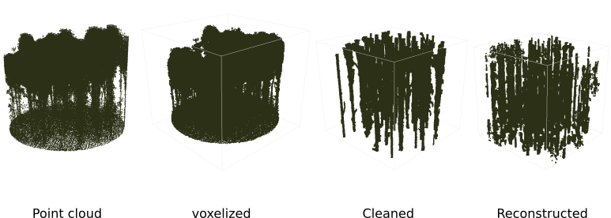

# Forest scene Reconstruction with Rocnet (Octree-based nn)



The following instrcutions are tested on conda 23.7.2


To run it you can use a conda exporeted Env.yml file and directly create a env for training:

```conda env create -n <desired-env-name> --file ENV.yml```

```pip install -r requirements.txt```

or to do this automatically just run  


```./install.sh```


Then you should open [the notebook](train_nb-128-32-Forest.ipynb) to do the training.
The notebook is run on sample(s) in ```./data/forest/``` folder (this folder contains datasets). To add/replace data you should convert your sample data into an Octree-based samples. To do so, I recommend to read [this](./data/preprocessing/readme.md) and based on the instructions prepared put the output data files into ```./data/forest/``` folder and run [the notebook](./train_nb-128-32-Forest.ipynb) afterwards.


